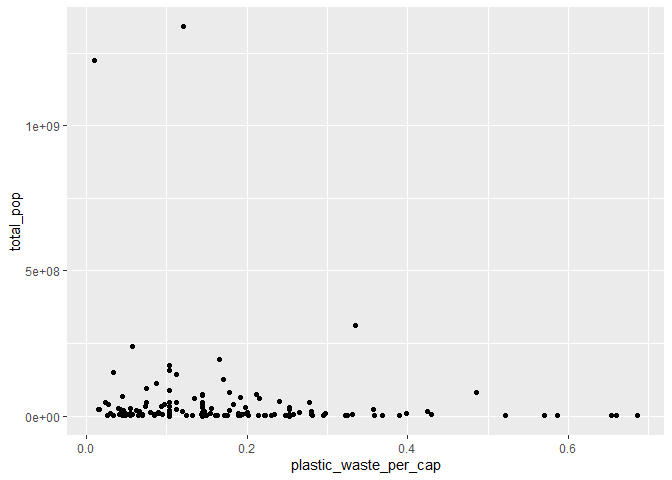
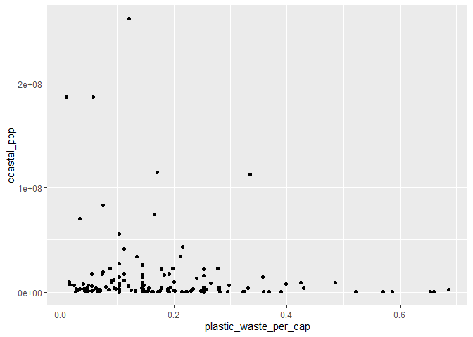
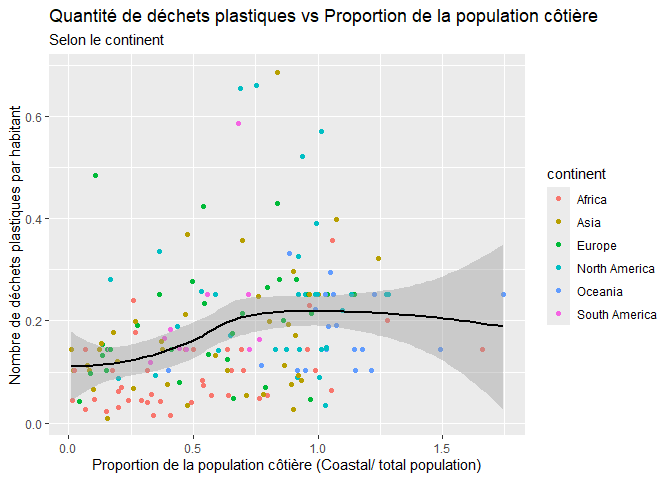

Lab 02 - Plastic waste
================
Juliane Champagne
2025-09-17

## Chargement des packages et des données

``` r
library(tidyverse) 
```

``` r
plastic_waste <- read_csv("data/plastic-waste.csv")
View(plastic_waste)
```

Commençons par filtrer les données pour retirer le point représenté par
Trinité et Tobago (TTO) qui est un outlier.

``` r
plastic_waste <- plastic_waste %>%
  filter(plastic_waste_per_cap < 3.5)
```

## Exercices

### Exercise 1

``` r
ggplot(plastic_waste, aes(x = plastic_waste_per_cap)) +
  geom_histogram(binwidth = 0.25) +
  labs(
    x = "plastic_waste_per_cap",
    y = "count") +
  facet_wrap(~ continent, nrow = 2)
```

<!-- -->

Chaque continents produisent beauoup de déchets par habitant. Cependant,
l’amérique du sud est un des continents qui produit la moitier moins de
de déchet que les autres par habitant.

    ### Exercise 2


    ``` r
    ggplot(plastic_waste, aes(x = plastic_waste_per_cap,
                              color = continent,
                              fill = continent)) +
      geom_density(adjust = 1,
                   alpha = 0.3) +
      labs(
        x = "plastic_waste_per_cap", 
        y = "density",
        color = "continent")

<!-- -->

Le réglage de la couleur et celui de la transparence ne se trouve pas au
même endroit car, lorsque nous écrivons dans aes ont est directement lié
au donné du problème. Lorsqu’on est dans geom_density () on est
directement lié aux valeurs constantes du problème.Ce qui veux dire
qu’elle s’appliquera à toute les données du problème et qu’elle ne
dépend pas d’une variable dans les données.

### Exercise 3

Boxplot:

``` r
ggplot(plastic_waste, aes(x = continent,
                          y = plastic_waste_per_cap)) +
  geom_boxplot() +
  labs(
    x = "continent",
    y = "plastic_waste_per_cap"
  )
```

<!-- -->

Violin plot:

``` r
ggplot(plastic_waste, aes(x = continent,
                          y = plastic_waste_per_cap)) +
  geom_violin() +
  labs(
    x = "continent",
    y = "plastic_waste_per_cap"
  )
```

<!-- -->

Avec les violin plot, il est possible de voir la présence de plusieurs
pics distincts ce que le boxplot n’offre pas, il montre seulement la
plus prononcée qui s’avère à être la médiane. De plus, il est possible
de voir la forme de la distribution sans nécessairement être représenté
en carré.

### Exercise 4

``` r
ggplot(plastic_waste, aes(x = plastic_waste_per_cap,
                          y = mismanaged_plastic_waste_per_cap,
                          color = continent)) +
  geom_point() +
  labs(
    x = "plastic_waste_per_cap",
    y = "mismanaged_plastic_waste_per_cap"
  ) +
  scale_colour_viridis_d()
```

<!-- -->
Selon le graphique nous pouvons remarqués que le continent(Asie) ayant
la plus grande population crée plus de déchet mais que ceux comme
l’amérique du sud et du nord produisent plus de déchet par habitant vue
que ceux-ci sont moins nombreux et qu’ils sont des continents ayant plus
de ressources.

### Exercise 5

``` r
ggplot(plastic_waste, aes(x = plastic_waste_per_cap,
                          y = total_pop)) +
  geom_point() +
  labs(
    x = "plastic_waste_per_cap",
    y = "total_pop")
```

    ## Warning: Removed 10 rows containing missing values or values outside the scale range
    ## (`geom_point()`).

<!-- -->

``` r
ggplot(plastic_waste, aes(x = plastic_waste_per_cap,
                          y = coastal_pop)) +
  geom_point() +
  labs(
    x = "plastic_waste_per_cap",
    y = "coastal_pop")
```

<!-- -->

Sur la Côte, la population semble plus grande à certain endroit mais
ceci fait en sorte que les gens on l’air de moins gaspiller de déchet
vue qu’ils sont plus, comparativement à la poulation total ne vivant pas
sur la côte.Le ratio n’est donc pas pareil.

## Conclusion

Recréez la visualisation:

``` r
ggplot(plastic_waste, aes(x = coastal_pop/ total_pop,
                          y = plastic_waste_per_cap,
                          color = continent)) +
  geom_point()  +
  geom_smooth(aes(group = 1), method = "loess", color = "black", se = TRUE) +
  labs(
    x = "Proportion de la population côtière (Coastal/ total population)",
    y = "Nombre de déchets plastiques par habitant",
    title = "Quantité de déchets plastiques vs Proportion de la population côtière",
    subtitle = "Selon le continent" )
```

    ## `geom_smooth()` using formula = 'y ~ x'

    ## Warning: Removed 10 rows containing non-finite outside the scale range
    ## (`stat_smooth()`).

    ## Warning: Removed 10 rows containing missing values or values outside the scale range
    ## (`geom_point()`).

<!-- -->

``` r
plastic_waste_coastal <- plastic_waste %>% 
  mutate(coastal_pop_prop = coastal_pop / total_pop) %>%
  filter(plastic_waste_per_cap < 3)    
```

Le nombre de déchet est assez constant selon la proportion de la
population cotière dans tout les pays, mais elle n’est pas linéaire..
