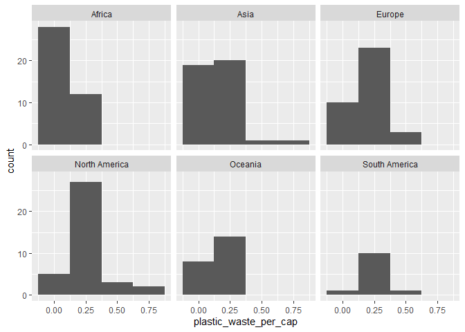
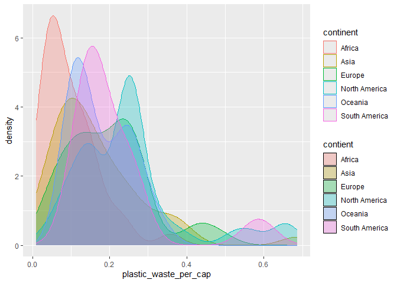

Lab 02 - Plastic waste
================
Juliane Champagne
2025-09-17

## Chargement des packages et des données

``` r
library(tidyverse) 
```

``` r
plastic_waste <- read_csv("data/plastic-waste.csv")
```

Commençons par filtrer les données pour retirer le point représenté par
Trinité et Tobago (TTO) qui est un outlier.

``` r
plastic_waste <- plastic_waste %>%
  filter(plastic_waste_per_cap < 3.5)
```

## Exercices

### Exercise 1

``` r
ggplot(plastic_waste, aes(x = plastic_waste_per_cap)) +
  geom_histogram(binwidth = 0.25) +
  labs(
    x = "plastic_waste_per_cap",
    y = "count") +
  facet_wrap(~ continent, nrow = 2)
```

<!-- -->

### Exercise 2

``` r
ggplot(plastic_waste, aes(x = plastic_waste_per_cap,
                          fill = continent,
                          color = continent)) +
  geom_density(adjust = 1,
               alpha = 0.3) +
  labs(
    x = "plastic_waste_per_cap", 
    y = "density",
    fill = "contient")
```

<!-- -->

Le réglage de la couleur et celui de la transparence ne se trouve pas au
même endroit car, lorsque nous écrivons dans aes ont est directement lié
au donné du problème. Lorsqu’on est dans geom_density () on est
directement lié aux valeurs constantes du problème.Ce qui veux dire
qu’elle s’appliquera à toute les données du problème.

### Exercise 3

Boxplot:

``` r
# insert code here
```

Violin plot:

``` r
# insert code here
```

Réponse à la question…

### Exercise 4

``` r
# insert code here
```

Réponse à la question…

### Exercise 5

``` r
# insert code here
```

``` r
# insert code here
```

Réponse à la question…

## Conclusion

Recréez la visualisation:

``` r
# insert code here
```
